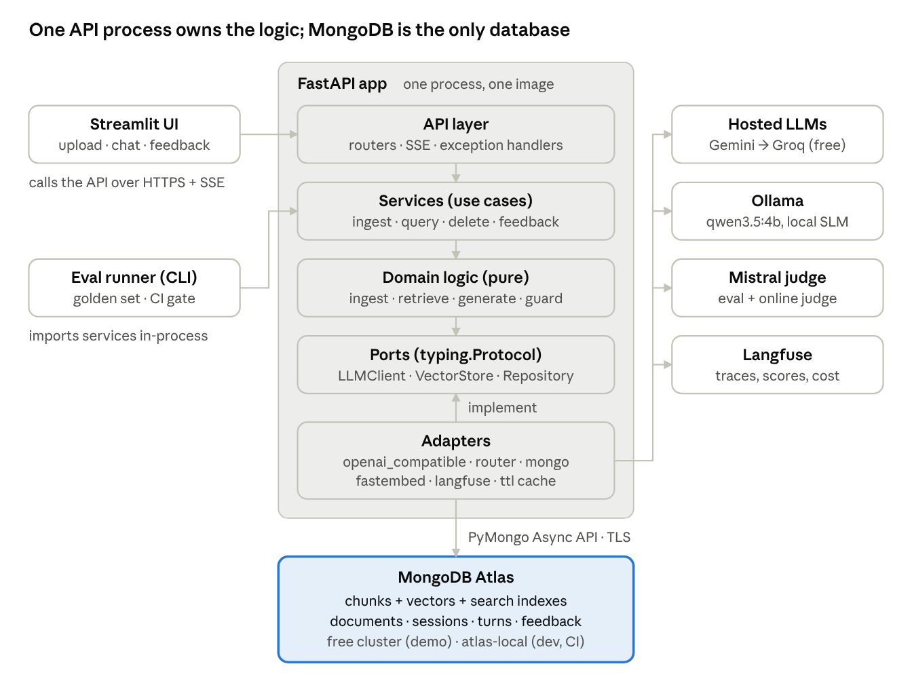

# DocQA

Ask questions about your PDFs and get short answers in which every claim cites the page
it comes from, or an honest "I couldn't find this in your documents".

**Problem.** Long PDFs hide the one fact a reader needs. Ctrl+F misses paraphrases, and
pasting a PDF into a chatbot gives answers with no page reference. DocQA cuts the time to
find *and verify* a fact from minutes to seconds (docs/PRD.md).

**Live demo:** not deployed yet. Steps are in [docs/runbooks/deploy.md](docs/runbooks/deploy.md).

> **Privacy:** answers come from free-tier hosted models (Gemini, Groq), which may use
> prompts to improve their products. Don't upload confidential files. For private documents
> use local mode (`DOCQA_PROFILE=local`: Ollama + atlas-local), where nothing leaves the machine.

## Architecture



One Python service in ports-and-adapters style ([docs/DESIGN.md](docs/DESIGN.md)):
upload → validate → extract (PyMuPDF) → chunk (page-aware) → embed (nomic, FastEmbed) →
MongoDB Atlas. A question → rewrite (follow-ups) → hybrid `$vectorSearch` + `$search` fused by
`$rankFusion`, pre-filtered by owner and document in both branches → MiniLM re-ranker →
abstain or generate (Gemini → Groq → Ollama router) → citation validation → streamed answer.

## Quick start

```bash
cp .env.example .env       # add MONGODB_URI and at least one LLM key
uv sync
make up                    # atlas-local MongoDB in Docker
make initdb                # collections + indexes, waits for READY
make dev                   # API on http://localhost:8000
uv run streamlit run ui/streamlit_app.py
```

Tests: `make test` (unit), `make test-int`, `make test-e2e`. Eval: write `eval/golden.jsonl`
(see `eval/golden.template.jsonl`), then `make eval`. Load: start the API with
`DOCQA_PROFILE=loadtest`, then `make load`.

## Numbers

Generated by `scripts/render_readme_tables.py` from the report files in `eval/reports/`.

<!-- numbers:start -->
| metric | value | source |
|---|---|---|
| eval scores, latency, cost, storage | not measured yet — run `make eval` | — |
| Throughput, stub | not measured yet — run `make load` | — |
| Throughput, real provider | not measured yet — run `locust ... --mode real` | — |
<!-- numbers:end -->

## Ablations (dev split)

<!-- ablations:start -->
not measured yet — run `uv run python -m eval.run_ablations`
<!-- ablations:end -->

## Free-tier limits and how DocQA stays inside them

| Limit | DocQA |
|---|---|
| Atlas free cluster: 512 MB storage | vectors packed as BSON float32 (~3 KB at 768-d); upload refused (507) at 400 MB or 500 documents |
| 100 ops/s | bulk writes of 64, one aggregation per query, one document ingested at a time; the load test reports peak ops/s |
| 3 search indexes | uses 2 (vector + full-text); an embedding change is a planned window ([runbook](docs/runbooks/embedding_upgrade.md)) |
| No backups, pause after 30 idle days | nightly `mongodump` and a weekly ping ([backup.yml](.github/workflows/backup.yml)) |
| LLM free tiers rate-limit (HTTP 429) | three providers behind a router with circuit breakers; passages-only answer if all fail |

## Resume line

Built DocQA, a RAG system for question answering over uploaded PDFs on MongoDB Atlas, with
hybrid vector + full-text retrieval fused by `$rankFusion`, cross-encoder re-ranking and
page-level citation verification, evaluated on a hand-written 40-question golden set
(numbers above), with Langfuse tracing, a CI eval gate and Dockerised deployment.
