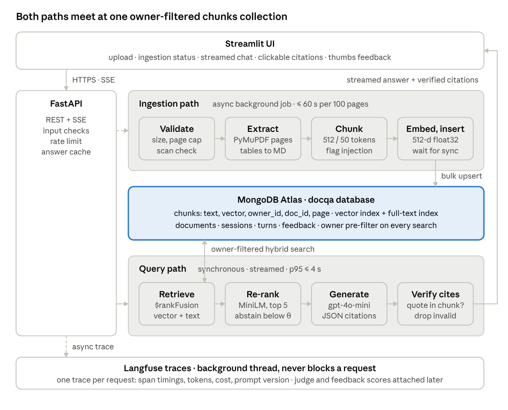

# PRD: DocQA (MongoDB revision)

> Converted from the original Word document. The .docx is the authoring source; this file is the copy agents read.

Oct 4, 2026 · @ray

## What changed in this revision

MongoDB Atlas now replaces both Qdrant and SQLite: one database holds documents, chunks, vectors, sessions, turns and feedback. Hybrid retrieval uses $vectorSearch and $search fused by $rankFusion (reciprocal rank fusion, constant fixed at 60). The demo runs on the Atlas free cluster; development and CI run on the mongodb/mongodb-atlas-local Docker image, which bundles the same search engine. Retrieval quality targets are unchanged.

| Area | Before | Now |
|---|---|---|
| Vector store | Qdrant Cloud free tier (1 GB) | Atlas Vector Search on the Atlas free cluster (512 MB total storage) |
| Keyword search | BM25 sparse vectors from FastEmbed in Qdrant | Atlas Search full-text index (Lucene BM25) |
| Fusion | Qdrant Query API RRF, k = 60 | $rankFusion, rank constant fixed at 60, optional per-branch weights |
| Metadata store | SQLite | MongoDB collections: documents, sessions, turns, feedback |
| Vector format | 512-d float vectors | Same 512-d vectors, stored as BSON binary float32 (not arrays of doubles) and scalar-quantized in the index |
| Local dev and CI | Qdrant Docker container | mongodb/mongodb-atlas-local container |
| Python client | qdrant-client | PyMongo Async API (AsyncMongoClient) |

Four new constraints come with the free cluster and are handled throughout this PRD: 512 MB storage, 100 operations per second, at most 3 search indexes, and search indexes that update a few seconds after a write rather than instantly.

## Overview and problem statement

We are building DocQA, a retrieval-augmented question-answering service over user-uploaded PDFs. It answers in under 4 seconds at p95, cites the page behind every claim, and says "not in the documents" instead of guessing. This PRD follows the course's 10-step design rubric (Week 5) and covers every item in the capstone deliverables checklist and presentation rubric.

Business objective (one sentence). Cut the time a reader needs to find and verify a specific fact in a long PDF from several minutes of manual scrolling to under 10 seconds, with an answer they can check against the cited page.

### The problem

Long PDFs (reports, policies, manuals, filings, papers) hide the one fact a reader needs among hundreds of pages. Ctrl+F only finds exact words, so it misses paraphrases ("leave policy" vs "paid time off"). Pasting a whole PDF into a chatbot is expensive, often exceeds the context window, and gives answers with no page reference, so the reader cannot tell a real fact from a hallucination.

The failure that matters most is a confident, fluent, wrong answer. As Week 7 put it, an LLM fails silently: no error code, no latency change. A wrong answer with a fake citation destroys trust permanently, so groundedness and honest abstention matter more than coverage.

### ML problem statement (formal)

Given a set of up to 10 text-based PDFs uploaded by one user (each ≤ 300 pages and ≤ 25 MB) and a natural-language question, retrieve the top-5 most relevant passages from that user's documents only, then generate a concise answer (≤ 150 words) in which every factual sentence cites a source document and page number. If no passage clears the relevance threshold, abstain with "I couldn't find this in your documents." Targets: p95 end-to-end latency ≤ 4 s, cost ≤ $0.002 per query.

| Element | Definition |
|---|---|
| Input | Question text (≤ 500 characters) + user ID + selected document set |
| Output | Answer text + list of citations (doc name, page, quoted snippet), or an abstention message |
| Task type | Rank (hybrid retrieval + re-ranking), then generate (grounded LLM answer with structured citations) |
| Prediction target | The passages that contain the answer, and an answer whose claims are all supported by those passages |
| Success | The answer is correct, every claim is supported by a cited passage, and the cited page actually contains the supporting text |

### Scope at a glance

In scope: text-based PDFs (with an embedded text layer), English, single-user private document sets, factual and multi-passage questions, page-level citations, multi-turn follow-ups within one session.

Out of scope (v1): scanned or image-only PDFs (OCR), Word/PowerPoint/HTML, charts and images inside PDFs, real-time or web data sources, cross-user sharing and role-based access, specialised domain reasoning (legal advice, financial modelling), non-English documents.

## Goals, users and use cases

v1 succeeds if it answers correctly and with valid citations on at least 80% of a hand-written 40-question eval set, abstains on at least 80% of unanswerable questions, and ships with measured latency, cost and quality numbers in the README.

### Goals and success metrics

| Goal | Metric | v1 target |
|---|---|---|
| Correct answers | Answer correctness (LLM-as-judge, 1–5 scale, ≥ 4 counts as correct) on the golden set | ≥ 80% |
| Grounded answers | RAGAS faithfulness (share of answer claims supported by retrieved context) | ≥ 0.90 |
| Retrieval finds the evidence | Recall@5 (gold passage is in the 5 chunks sent to the LLM) | ≥ 0.85 |
| Citations are real | Citation accuracy (cited page contains the supporting text) | ≥ 90% |
| Honest abstention | Correct abstentions on unanswerable questions / false abstentions on answerable ones | ≥ 80% / ≤ 10% |
| Fast | End-to-end latency p50 / p95 / p99 (warm instance) | ≤ 2.5 s / ≤ 4 s / ≤ 6 s |
| Cheap | LLM + embedding cost per query | ≤ $0.002 |
| Fast ingestion | Time from upload to "ready" (searchable in both indexes) for a 100-page PDF | ≤ 60 s |
| Observable | Share of requests with a complete trace (latency, tokens, cost, prompt version) | 100% |

### Non-goals

- Beating frontier long-context models on open-ended summarisation of an entire book.
- Multi-tenant enterprise features: SSO, role-based access, document sharing between users.
- Fine-tuning any model. All quality gains come from retrieval, prompting and evaluation.
- Horizontal scale beyond the free-tier target in Estimations (the 10× question is answered on paper, not built).

### Users

| Persona | What they upload | What they need |
|---|---|---|
| Student or researcher | Papers, textbooks, lecture PDFs | Find a definition, a result or a method detail and cite the page |
| Analyst or associate | Annual reports, filings, research reports | Pull a specific figure or disclosure and verify it against the source page |
| Employee or professional | Policies, manuals, contracts, SOPs | Get the rule or procedure that applies, with the clause to point to |

### Core use cases

- Upload and index. The user uploads one or more PDFs and sees a progress state (validating, extracting, indexing, ready) and a page count per file. "Ready" means the chunks are visible to both the vector and full-text indexes.
- Ask a factual question. "What was the total revenue in FY2025?" returns a short answer with [Doc, p. 47] citations; clicking a citation shows the quoted passage.
- Ask a multi-passage question. "How did the refund policy change between the 2023 and 2025 versions?" draws on chunks from two documents and cites both.
- Follow up. "And for international orders?" is rewritten into a standalone question using the session history before retrieval.
- Ask something the documents don't cover. The system abstains and suggests rephrasing, instead of answering from the model's general knowledge.
- Give feedback. Thumbs up/down with an optional comment, attached to the request's trace for evaluation.

## Requirements

The requirements below are architectural constraints: the 4 s p95 budget forces streaming and a small re-ranker, the privacy requirement forces a pre-filter in both search branches, the $5–20 budget forces an API model with caching, and the 512 MB free cluster forces compact vector storage.

### Functional requirements

| ID | Requirement | Priority |
|---|---|---|
| FR-1 | Upload up to 10 PDFs per session; reject non-PDF, encrypted, > 25 MB or > 300-page files with a clear message | P0 |
| FR-2 | Detect PDFs with no usable text layer (< 50 characters per page on average) and reject them as "scanned, not supported in v1" | P0 |
| FR-3 | Extract text page by page, keeping page number, section heading and reading order; extract simple tables as Markdown | P0 |
| FR-4 | Chunk, embed and index asynchronously; expose ingestion status (queued, extracting, indexing, syncing, ready, failed); mark ready only after the search indexes return every chunk of the document | P0 |
| FR-5 | Answer a question using only the selected documents, with hybrid retrieval ($vectorSearch + $search fused by $rankFusion) and re-ranking | P0 |
| FR-6 | Return structured citations (doc, page, snippet) for every factual sentence; verify each cited chunk ID was actually retrieved | P0 |
| FR-7 | Abstain when the best re-ranker score is below a calibrated threshold, or when the LLM reports insufficient context | P0 |
| FR-8 | Stream the answer token by token to the UI | P0 |
| FR-9 | Show the cited passage and page when a citation is clicked | P1 |
| FR-10 | Rewrite follow-up questions into standalone queries using the last 3 turns | P1 |
| FR-11 | Collect thumbs up/down and optional text feedback, attached to the trace | P0 |
| FR-12 | Delete a document: remove its chunk documents, its record and any cached answers that cite it, within 1 minute | P1 |
| FR-13 | Expose /health, /documents, /query, /feedback REST endpoints so the UI and load tests share one API | P0 |

### Non-functional requirements

| Category | Requirement | Target |
|---|---|---|
| Latency | End-to-end answer, warm instance | p50 ≤ 2.5 s, p95 ≤ 4 s, p99 ≤ 6 s |
| Latency | Time to first token | p95 ≤ 1.5 s |
| Ingestion | 100-page text PDF from upload to ready (including search-index sync) | ≤ 60 s |
| Throughput | Sustained load without errors on a free-tier instance | ≥ 2 queries/s, 8 concurrent users, error rate < 1% |
| Database throughput | Operations sent to the Atlas free cluster (limit 100 ops/s) | ≤ 60 ops/s at peak, including ingestion batches |
| Storage | Total data + index size on the Atlas free cluster (limit 512 MB) | ≤ 400 MB; hard cap of 500 indexed documents in the demo |
| Availability | Demo deployment during evaluation window | ≥ 99% (cold start after sleep ≤ 60 s, documented) |
| Cost | API spend per query (generation + query embedding) | ≤ $0.002; whole project ≤ $20 |
| Cost | Hard cap on context sent to the LLM | ≤ 6,000 input tokens per request |
| Quality | Faithfulness / Recall@5 / citation accuracy on golden set | ≥ 0.90 / ≥ 0.85 / ≥ 90% |
| Privacy | A user's query can only retrieve chunks from that user's documents | 100%, enforced as a pre-filter in both $vectorSearch (filter) and $search (compound.filter) |
| Privacy | PII (emails, phone numbers, ID-like numbers) scrubbed from logs and traces | 100% of logged inputs and outputs |
| Security | Retrieved text wrapped as data; instruction-like patterns flagged at index time | All chunks |
| Security | Database access uses a least-privilege Atlas user and an IP access list | readWrite on the docqa database only |
| Reproducibility | Prompts, model names, chunking, retrieval parameters and index definitions in versioned config files, never hard-coded | 100% |
| Maintainability | One Docker image runs locally and in deployment; CI runs unit tests + eval gate on every PR | Required |

## Estimations

Storage, not cost, is the new binding constraint: at about 0.5 MB per 100-page document, the 512 MB free cluster holds roughly 1,000 documents in theory, so the demo caps the index at 500. Design target for a public demo is unchanged: 50 daily users, 10 questions each, peak 2 queries/s. Prices are list prices assumed for planning (gpt-4o-mini at $0.15 / $0.60 per million input / output tokens, text-embedding-3-small at $0.02 per million); confirm current pricing before the final README.

| Quantity | Calculation | Result |
|---|---|---|
| Daily queries | 50 users × 10 questions | 500 / day |
| Requests in flight at peak (Little's law) | 2 QPS × 4 s | 8 concurrent |
| Chunks per document | 100 pages × ~500 tokens = 50K tokens; 512-token chunks with 50 overlap | ~110 chunks |
| Vector bytes per chunk | 512 dims × 4 bytes as BSON binary float32 (an array of doubles would take ~5.6 KB) | ~2 KB |
| Stored bytes per chunk | vector 2 KB + text ~2 KB + metadata ~0.3 KB | ~4.4 KB |
| Storage per document | 110 × 4.4 KB, plus B-tree indexes (~10 KB) | ~0.5 MB |
| Storage for 500 documents | 500 × 0.5 MB | ~250 MB (fits ≤ 400 MB NFR; 1,000 documents would reach ~500 MB, at the cap) |
| Search indexes on the free cluster | 1 vector index + 1 full-text index on chunks | 2 of the 3 allowed |
| Database ops per query | 1 $rankFusion aggregate + 1 history read + 2 turn inserts | ~4 ops; 8 ops/s at 2 QPS |
| Database ops while ingesting | 110 chunk inserts over ~30 s + status updates + 1 sync check/s | ~5 ops/s per document |
| Network out per query | 20 fused candidates × ~2.5 KB (vectors projected out after fusion) | ~50 KB; ~25 MB/day, far under the 10 GB per 7 days cap |
| Embedding cost per document | 50K tokens × $0.02 / 1M | $0.001 |
| Tokens per query | System prompt 600 + 5 chunks × 512 + history and question 300 = ~3,500 in; ~300 out | ~3,800 |
| Generation cost per query | 3,500 × $0.15/1M + 300 × $0.60/1M | ~$0.0007 |
| Daily API cost | 500 × $0.0007 | ~$0.35 / day |
| One full eval run | 40 questions × (1 generation + ~3 judge calls) | ~$0.10 |
| Budget headroom | $20 ÷ $0.0007 | ~28,000 queries |

The estimate shows that cost is not the binding constraint at demo scale; storage on the free cluster and latency on a CPU-only free tier are. That is why vectors are stored as packed float32 binaries, the re-ranker is a small MiniLM cross-encoder, and embeddings come from an API rather than a local model. The free-stack variant (768-d nomic embeddings) raises storage to ~0.6 MB per document, which still fits 500 documents in ~300 MB.

## System architecture

The system has two paths that share one MongoDB chunks collection: an asynchronous ingestion path that turns a PDF into tagged, searchable chunk documents, and a synchronous query path that retrieves, re-ranks, generates and verifies an answer within 4 s. Tracing runs in the background on both paths, so monitoring never adds latency.

DocQA architecture · ingestion and query paths over MongoDB Atlas

Uploads enter the ingestion path as a background job; questions run the query path inside the API and stream back to the UI. Both paths only touch chunks tagged with the requesting user's ID.

### Components

| Component | What it does | Choice | Requirement it serves |
|---|---|---|---|
| Web UI | Upload, ingestion status, chat with streamed answers, clickable citations, thumbs feedback | Streamlit | FR-1, FR-8, FR-9, FR-11 |
| API gateway | Validation, auth by session ID, rate limit per user, routes to ingestion or query | FastAPI (async, Server-Sent Events) | FR-13, NFR latency |
| Upload validator | File type, size, page count, encryption, text-layer density | PyMuPDF checks | FR-1, FR-2 |
| Extractor | Page-level text with headings and reading order; tables to Markdown | PyMuPDF + pdfplumber for tables | FR-3 |
| Sanitiser | Flags instruction-like text ("ignore previous instructions"), strips control characters, marks risky chunks without deleting content | Regex rules + small pattern list | Security NFR |
| Chunker | Recursive split at headings, then paragraphs, then sentences; 512 tokens, 50 overlap; never crosses a page boundary without recording both pages | Recursive splitter + tiktoken | FR-4, citation accuracy |
| Embedder | Batch-embeds chunks and queries with one pinned model version | OpenAI text-embedding-3-small, truncated to 512 dims, stored as BSON binary float32 | Recall@5, storage NFR |
| Database | One docqa database: chunks (text, vector, owner_id, doc_id, page range, section, hashes, embed model), documents, sessions, turns, feedback | MongoDB Atlas free cluster (demo); mongodb-atlas-local (dev, CI) | FR-4, FR-5, FR-11, FR-12, privacy NFR |
| Search indexes | Vector index on chunks.embedding with owner_id and doc_id as filter fields (scalar quantization); full-text index on chunks.text with owner_id, doc_id as token fields | Atlas Vector Search + Atlas Search (2 of the 3 indexes the free cluster allows) | FR-5, privacy NFR |
| Query rewriter | Turns a follow-up into a standalone question using the last 3 turns; skipped on the first turn | gpt-4o-mini, short prompt | FR-10 |
| Hybrid retriever | One aggregation: $rankFusion over a $vectorSearch branch (top 20, pre-filtered) and a $search branch (top 20, compound.filter), then $limit 20 and project out vectors | MongoDB aggregation pipeline | FR-5, privacy NFR |
| Re-ranker | Scores 20 (query, chunk) pairs; keeps top 5; its top score drives abstention | cross-encoder ms-marco-MiniLM-L-6-v2 on CPU | Recall@5 precision, FR-7 |
| Generator | Answers only from the 5 chunks, returns JSON {answer, citations[chunk_id, quote], sufficient_context} | gpt-4o-mini with structured outputs; fallback Gemini Flash | FR-6, FR-7, FR-8 |
| Output validator | Checks every cited chunk_id was retrieved and every quote appears in that chunk; drops invalid citations; flags answers with no valid citation | Python checks | FR-6, citation accuracy |
| Answer cache | Key = hash(owner_id, sorted doc_ids, normalised question, prompt_version, model); TTL 1 h; purged when a cited doc is deleted | In-process TTL cache (a MongoDB TTL collection if multi-instance, instead of Redis) | Cost NFR |
| Observability | One trace per request with spans, tokens, cost, prompt version, hashed user ID; feedback and judge scores attached as scores | Langfuse (async SDK) | Deliverable 4 |
| Evaluation | Golden-set runner, RAGAS metrics, LLM judge, CI gate | RAGAS + pytest + GitHub Actions | Deliverable 3 |

### Data flow

Ingestion path (asynchronous, target ≤ 60 s for 100 pages):

- UI posts the file to POST /documents; the API validates it, inserts a documents record with status queued and returns 202 Accepted with a doc_id within 1 s.
- A background worker extracts text per page, runs the sanitiser, and chunks it.
- The worker embeds chunks in batches of 100 and packs each vector as BSON binary float32.
- It writes chunk documents with bulk_write of ReplaceOne(upsert=True) keyed on _id = uuid5(doc_id, chunk_index), 64 per batch, so a retry never duplicates and ingestion stays well under 100 ops/s.
- Status becomes syncing: the worker polls a filtered $search count for the doc_id once a second until it equals the chunk count (timeout 30 s), because search indexes catch up a few seconds after writes.
- Status becomes ready (or failed with the error). The UI polls GET /documents/{id}.

Query path (synchronous, target p95 ≤ 4 s):

- UI sends POST /query {session_id, question, doc_ids}. The API checks length, rate limit and the answer cache.
- If it is a follow-up, the rewriter produces a standalone question.
- The retriever embeds the question and runs one $rankFusion aggregation: the vector branch filters {owner_id, doc_id: {$in: doc_ids}}; the text branch uses compound.filter with equals on owner_id and in on doc_id; each branch returns 20, fused by RRF with rank constant 60.
- The re-ranker keeps the top 5. If the best score is below θ (calibrated on the golden set), the API returns an abstention without calling the generator.
- The prompt builder places the static system prompt first (to benefit from provider prompt caching), then the chunks inside [BEGIN DOCUMENT id=… page=…] markers, then the question.
- The generator streams the answer; the output validator checks citations once the JSON is complete and the UI renders verified citations.
- The API appends the user and assistant turns (PII-scrubbed) to turns; the Langfuse SDK ships the trace in the background; feedback arrives later via POST /feedback and is attached to the same trace ID.

### Component interactions

| From → To | Mode | Protocol | Data format |
|---|---|---|---|
| UI → API (documents, feedback) | Sync request, async job for ingest | HTTPS REST | multipart/form-data in, JSON out |
| UI → API (query) | Sync, streamed | HTTPS + Server-Sent Events | JSON request; token events, then a final JSON citations event |
| API → ingestion worker | Async | In-process job queue (asyncio) | Job JSON {doc_id, path} |
| Worker, retriever → embeddings API | Sync | HTTPS | JSON, batched texts → float vectors |
| Worker, retriever, services → MongoDB | Sync (async driver) | MongoDB wire protocol over TLS (PyMongo Async API) | BSON documents; aggregation pipelines for search |
| Retriever → re-ranker | Sync | In-process call | List of (query, chunk) pairs → scores |
| Generator → LLM API | Sync, streamed | HTTPS | Chat messages in; JSON schema output |
| API → Langfuse | Async, background batch | HTTPS (SDK) | Trace and span JSON |
| GitHub Actions → eval runner | Batch on PR | CLI against an atlas-local service container | Golden-set JSONL in, metrics JSON + Markdown report out |

### Latency budget (p95)

| Stage | Budget |
|---|---|
| Validation, cache lookup, rate limit | 50 ms |
| Query rewrite (follow-ups only; 0 on first turn) | 400 ms |
| Query embedding | 150 ms |
| Hybrid retrieval: $rankFusion (branches run one after the other on a shared free cluster) | 250 ms |
| Cross-encoder re-rank, 20 pairs on CPU | 400 ms |
| LLM generation, ~300 output tokens (first token ≤ 1 s) | 2,500 ms |
| Citation validation + final event | 100 ms |
| Network and slack | 150 ms |
| Total | 4,000 ms |

Retrieval gets 100 ms more than in the Qdrant design because $rankFusion runs its sub-pipelines serially, paid for by 100 ms less slack; place the Atlas cluster in the region nearest the app host. Because the answer streams, users start reading after about 1.5 s.

## Key design decisions and trade-offs

Thirteen "we chose X over Y because Z" decisions; the database decision is the one this revision changes, and the two after it follow from it.

| Decision | We chose | Over | Because |
|---|---|---|---|
| Database | MongoDB Atlas for chunks, vectors and all metadata | Qdrant + SQLite | One store, one client and one backup story instead of two; native vector + full-text search with pre-filters; free cluster for the demo and an identical local image for CI. The cost: 512 MB storage, 100 ops/s, 3 search indexes, and serial $rankFusion branches, all sized for in Estimations. |
| Fusion | Server-side $rankFusion (RRF, constant 60) | App-side RRF over two queries | One round trip instead of two and no score-scale juggling. The cost: the rank constant cannot be tuned and branches run serially; a pure-Python rrf_fuse stays for the in-memory test store and the weight ablation. |
| Access control | Pre-filter inside both branches: $vectorSearch.filter and $search compound.filter | $match after fusion | A post-filter ranks other users' chunks first, which can leak into logs or context and leave the user with fewer than 5 results (Week 7). The retriever refuses to build a pipeline without an owner filter. |
| Vector storage | BSON binary float32 vectors, scalar quantization in the index | Arrays of doubles, no quantization | An array of 512 doubles costs ~5.6 KB per chunk against ~2 KB packed, which decides whether 500 documents fit the free cluster; quantization cuts index memory with a small recall cost we measure. |
| Retrieval | Hybrid vector + full-text (Lucene BM25) with RRF | Vector only | PDFs are full of exact terms (clause numbers, figures, defined terms, product codes) that embeddings miss. We report the ablation on the golden set. |
| Context strategy | Retrieve top-5 chunks | Put the whole PDF in a long-context prompt | A 300-page PDF is ~150K tokens: ~40× the cost per query, slower, and prone to "lost in the middle". Week 7's Incident 3 was a 10× cost blow-up from exactly this. |
| Model hosting | API model (gpt-4o-mini) | Self-hosted Llama with vLLM | The budget is $5–20 and the free tier has no GPU. Week 3's break-even is ~$10K/month of API spend; we are at ~$10/month. The cost: document text leaves our infrastructure, so the UI warns users not to upload confidential files. |
| Re-ranker | MiniLM-L-6 cross-encoder on CPU | No re-ranker, or Atlas native $rerank | Re-ranking 20 candidates buys precision for ~400 ms and $0. Atlas $rerank needs MongoDB 8.3+, while the free cluster runs 8.0, and it adds a paid API. L-6 over L-12 because L-12 roughly doubles CPU time. |
| Chunking | Recursive, heading- and page-aware, 512/50 | Semantic chunking | Semantic chunking embeds every sentence at index time, which breaks the 60 s ingestion target. We tune size (256 / 512 / 1,024) by context recall. |

| Embedding size | 512 dims (Matryoshka truncation) | Full 1,536 dims | 3× smaller vectors keep 500 documents at ~250 MB on the 512 MB free cluster; we measure the Recall@5 cost and revert if it exceeds 2 points. |
| Judge model | Gemini Flash as judge | gpt-4o-mini judging itself | Self-preference bias: a model rates its own family's style too favourably (Week 7). |
| Caching | Exact-match answer cache keyed by documents and prompt version | Semantic cache | A semantic cache can return the answer to a similar-but-different question ("FY24 revenue" vs "FY25 revenue"), a silent wrong answer. A lower hit rate is the price. |
| Abstention | Threshold on re-ranker score plus a model-reported sufficient_context flag | Always answer | An honest "not found" protects trust; a fluent guess destroys it. θ is set to hit ≤ 10% false abstentions on the golden set. |

## Evaluation, monitoring and deployment

Quality is measured twice: offline on a hand-written 40-question golden set that gates every prompt, model or retrieval change in CI, and online through sampled LLM-as-judge scores and user feedback on live traces. Monitoring covers all five Week 7 categories plus the free cluster's limits, and every change ships behind a versioned config that can be rolled back in one step.

### Offline evaluation: the golden set

The team writes 40 questions by hand from a fixed corpus of 10 public PDFs from one domain (proposed: company annual reports and public policy documents, 40–300 pages each, chosen for tables, defined terms and cross-references). No public benchmark questions and no LLM-generated questions. Each record stores id, question, gold_answer, gold_doc, gold_pages, gold_quote, category, committed as eval/golden.jsonl.

We tune on a 28-question dev split and keep a 12-question frozen split that is only used for final reported numbers, so we don't overfit to the set we report (Week 3).

| Category | Count | What it tests |
|---|---|---|
| Single-passage factual | 16 | Basic retrieval and grounded generation |
| Table or number lookup | 6 | Table extraction and exact-term (full-text) retrieval |
| Multi-passage or cross-document | 6 | Top-5 coverage and synthesis across chunks |
| Follow-up (2-turn) | 4 | Query rewriting |
| Unanswerable (plausible but not in corpus) | 8 | Abstention instead of hallucination |

| Metric | How it is scored | Tool | Target |
|---|---|---|---|
| Recall@5 | Gold page is among the pages of the 5 chunks sent to the LLM | Python script | ≥ 0.85 |
| MRR@20 | Reciprocal rank of the first gold-page chunk in the fused list, before re-ranking | Python script | Reported (baseline for ablations) |
| Context precision / recall | RAGAS, against gold answer | RAGAS | ≥ 0.75 / ≥ 0.85 |
| Faithfulness | RAGAS: share of answer claims supported by retrieved context | RAGAS (judge: Gemini Flash) | ≥ 0.90 |
| Answer correctness | LLM judge with a 1–5 rubric against gold answer; ≥ 4 = correct | Custom judge prompt (Gemini Flash) | ≥ 80% |
| Citation accuracy | Cited quote appears verbatim on the cited page | Programmatic check | ≥ 90% |
| Abstention accuracy | Abstains on unanswerable; answers on answerable | Programmatic check | ≥ 80% / ≤ 10% false abstain |
| Latency, tokens, cost | From Langfuse traces of the eval run | Langfuse export | Within NFR targets |

Ablations reported in the README: vector-only vs hybrid; $rankFusion weights 1:1 vs 2:1 vector; re-ranker on vs off; chunk size 256 / 512 / 1,024; embedding 512 vs 1,536 dims; scalar quantization on vs off; top-k 3 / 5 / 8. Each is one row of Recall@5, faithfulness, correctness, p95 latency and cost per query, so every design decision above is backed by a number. Ablations run on the local atlas-local container, which has no storage or index-count cap.

### Online evaluation

- User feedback: thumbs up/down + optional comment, stored in feedback and as a Langfuse score on the trace. North-star metric: answer satisfaction rate (share of thumbs-up).
- LLM-as-judge on live traffic: a daily job samples 20% of traces (low demo traffic makes a high rate affordable) and scores groundedness, correctness-to-context and citation validity with Gemini Flash.
- Judge calibration: the team hand-labels 20 traces per week; we report the judge's agreement (Pearson correlation) with human scores and re-calibrate whenever the judge prompt or model changes.
- Behavioural signals: rephrase rate (same session, similar question within 60 s), abstention rate, citation-click rate.
- A/B testing: demo traffic is too small for a powered A/B test, so prompt and model candidates are compared offline on the golden set and by replaying the last week's logged questions (shadow replay) with judge scoring. At real scale we would randomise by session, run ≥ 14 days, and promote only if satisfaction rises with no drop in faithfulness or citation accuracy.

### Guardrails

| Stage | Guardrail | Behaviour on trigger |
|---|---|---|
| Input | Question length ≤ 500 chars; per-session token bucket of 10 questions/min | Reject with message / HTTP 429 |
| Input | Prompt-injection heuristics on the question | Answer normally but log a flag; alert on spikes |
| Input | PII scrub (regex + Presidio) before anything is logged or written to turns | Traces and turns store the scrubbed text only |
| Ingestion | Instruction-like patterns in document text | Chunk flagged; still indexed, always wrapped in document markers |
| Ingestion | Storage guard: refuse new uploads when the cluster passes 400 MB or 500 documents | HTTP 507 with a clear message |
| Retrieval | Owner and document pre-filter in both search branches | Other users' chunks are never retrieved; a pipeline without the filter raises |
| Retrieval | Re-ranker score below θ | Abstain without calling the LLM (saves cost too) |
| Generation | System prompt: answer only from documents; treat marked text as data; return sufficient_context | Abstain if false |
| Output | Citation validation (ID retrieved, quote present in chunk) | Drop invalid citations; if none remain, show "couldn't verify" warning |
| Cost | ≤ 6,000 input tokens per request; per-session daily quota | Truncate context to top chunks; block when quota is spent |

### Monitoring

Traces and scores live in Langfuse; a Streamlit admin page (or the Langfuse dashboard) shows latency percentiles, cost per request, judge scores and feedback over time. Database health comes from dbStats and $listSearchIndexes, since the free cluster's Atlas metrics view shows only connections, logical size, network and opcounters. Alerts are a scheduled check script that posts to a team channel or email; at demo scale this replaces a full alerting stack.

| Category | Metric | Alert threshold |
|---|---|---|
| Operational | End-to-end latency p50 / p95 / p99 per prompt version | p95 > 4 s for 10 min |
| Operational | LLM error and timeout rate; circuit breaker opens | > 2% over 10 min |
| Operational | Cost per request and daily spend | Any request > 5× median; daily spend > $2 |
| Operational | Ingestion time per page, failure rate and search-index sync lag | p95 > 1 s/page; failures > 5%; sync > 20 s |
| Database | Ops/s (opcounters), storage size, connections, search index status | > 60 ops/s for 5 min; > 400 MB; any index not READY |
| Input | Question length distribution; injection-flag rate | Injection flags > 3σ above 7-day mean |
| Input | Share of uploads rejected as scanned | > 30% (signals OCR demand) |
| Output | Abstention rate; answer length; invalid-citation rate | Abstention outside 5–30%; invalid citations > 5% |
| Quality | Daily judge groundedness; 7-day thumbs-up rate | Groundedness drop > 0.05; thumbs-up drop > 10 points |
| Drift | Median top re-ranker score (retrieval quality drift) | Falls > 15% week over week |
| Drift | Query topic clusters (weekly k-means on query embeddings) | New cluster > 5% of traffic |
| Drift | Prompt and model version on every trace | Quality compared across versions before promotion |

### Deployment, rollout and rollback

- Packaging: one Docker image (FastAPI + Streamlit). docker-compose locally with a mongodb/mongodb-atlas-local container; the public demo runs on Streamlit Community Cloud or Render with the Atlas free cluster as the managed database (least-privilege user, IP access list).
- Schema and indexes as code: scripts/init_db.py creates collections, B-tree indexes and both search indexes from config/indexes/*.json, waits until each search index reports READY, and is idempotent. CI and the demo use the same definitions.
- Configuration: config/*.yaml holds model names, chunking, retrieval k, $rankFusion weights, θ and the active prompt version; prompts live in prompts/<name>/v<N>.yaml. Every trace records both versions.
- CI/CD (GitHub Actions): on every PR, lint + unit tests + integration tests against an atlas-local service container, then the golden-set eval if prompts/, config/ or retrieval code changed. Eval gate: block merge if faithfulness drops by > 0.03, Recall@5 drops by > 0.03, or citation accuracy falls below 90%. Merge to main builds and pushes an image tagged with the commit SHA and deploys to staging; a manual approval promotes the same image to production.
- Backups: the free cluster has no backups, so a nightly GitHub Actions job runs mongodump of the docqa database to an artifact; a weekly scheduled ping also keeps the cluster from auto-pausing after 30 days without connections.
- Rollout: a new prompt or model goes live behind a config flag; with no traffic splitting on a single instance, we compare via shadow replay and judge scores for 24 h before switching the default.
- Rollback: redeploy the previous image tag (< 5 min), or flip the prompt version back in config without a rebuild. A new embedding model needs a full re-index; chunks store embed_model and the API refuses to query a collection whose model differs from its own. Locally this is blue-green (a new chunks_<model> collection, then a switch). On the free cluster the 3-index cap rules out running both versions at once, so a model change is a planned window: dump, drop the old search indexes, re-embed, rebuild, verify on the golden set.
- Resilience: 8 s timeout on the LLM; after 3 consecutive failures the circuit breaker opens for 60 s and routes to Gemini Flash; if that also fails, the API returns the top 3 passages with "summary unavailable". If MongoDB is unreachable, /health returns 503 and /query fails fast with a clear message.
- Load test: Locust, 8 concurrent users for 10 minutes against the deployed URL with questions sampled from the golden set; README reports throughput, p50/p99 latency, error rate and peak database ops/s.

## Delivery plan, risks and future scope

The plan is six one-week milestones that end with a presentation-ready system on 15 Nov 2026; the MongoDB switch lands in M1 and M2, so later milestones keep their dates. The instructor's actual deadline will replace these dates once announced.

### Milestones

| Milestone | Dates (2026) | Exit criteria |
|---|---|---|
| M1 · Corpus, golden set, repo | Oct 5 – Oct 11 | 40 golden questions committed; repo skeleton with config and prompt files; atlas-local in docker-compose; Atlas free cluster created; init_db.py builds both search indexes |
| M2 · Ingestion + baseline RAG | Oct 12 – Oct 18 | Answers end to end with vector-only $vectorSearch; ingestion waits for index sync; baseline eval recorded |
| M3 · Hybrid, re-rank, citations | Oct 19 – Oct 25 | $rankFusion with owner pre-filters in both branches; meets Recall@5 and citation targets on the dev split |
| M4 · Langfuse, eval runner, CI | Oct 26 – Nov 1 | Traces every request; CI runs integration tests on an atlas-local service container and blocks a bad PR |
| M5 · Deploy, load test, ablations | Nov 2 – Nov 8 | Live URL on the Atlas free cluster; Locust numbers incl. peak ops/s; ablation table; nightly mongodump |
| M6 · README, slides, rehearsal | Nov 9 – Nov 15 | README numbers filled in; timed rehearsal under 15 minutes |

### Deliverables checklist mapping

| Checklist item | How DocQA satisfies it | Status |
|---|---|---|
| 1. Live deployment (optional) | Docker image on Streamlit Community Cloud or Render, built from main; MongoDB Atlas free cluster | Planned (M5) |
| 2. Public GitHub repo + README | README sections: problem statement, architecture diagram, numbers table (p50/p99, cost per request, eval scores, Locust throughput), setup, live link | Planned (M6) |
| 2. Prompts and config versioned | prompts/<name>/v<N>.yaml, config/*.yaml and config/indexes/*.json; version tagged on every trace | Planned (M1) |
| 3. Hand-written eval set | 40 domain-specific Q&A pairs in eval/golden.jsonl; scoring method documented in eval/README.md | Planned (M1, M4) |
| 4. Observability | Langfuse traces with per-request latency, tokens and cost; dashboard view; database ops and storage on the admin page | Planned (M4) |
| 5. Presentation | 15 min + 5 min Q&A, structured on the rubric below; peer-review sheet prepared | Planned (M6) |
| 6. Resume line | Draft below, numbers filled in after M5 | Draft |

### Presentation rubric mapping

| Criterion (weight) | Where the evidence comes from |
|---|---|
| Problem framing (20%) | One-sentence business objective; formal ML problem statement; FR/NFR tables with values; in/out of scope |
| Architecture design (30%) | Architecture diagram; components table with justification; end-to-end data flow; interactions table (sync/async, protocol, format); latency budget |
| LLMOps depth (20%) | Deployment, rollout and rollback plan; monitoring across all 5 categories plus database limits; offline golden set + online judge and feedback; tools named with reasons |
| Trade-off reasoning (20%) | 13 "we chose X over Y because Z" decisions, each backed by an ablation number; failure modes below |
| Presentation quality (10%) | Rehearsed to 14 minutes; each team member owns one workstream and presents it |

### Risks and failure modes

| What breaks | How we detect it | Mitigation |
|---|---|---|
| Confident wrong answer (retrieval-generation gap) | Faithfulness and judge groundedness drop; thumbs-down | Answer only from context; citation validation; abstention threshold; eval gate in CI |
| Free cluster storage fills (512 MB) | Storage size alert at 400 MB | 500-document cap; packed float32 vectors; 512-d embeddings; delete stale demo uploads |
| Free cluster throttles at 100 ops/s | Opcounter alert; latency spikes during ingestion | Bulk writes of 64; one aggregate per query; queue ingestion one document at a time |
| Search index not yet synced after upload | Sync-lag metric; "ready" documents returning no hits in tests | syncing status; ready only when the filtered $search count equals the chunk count |
| A search index stuck building or FAILED | $listSearchIndexes status check in /health | init_db.py re-creates from config; /health returns 503 until READY |
| Missing owner filter in a new query path | Contract test "search without AccessFilter is impossible" | Retriever only builds pipelines from an AccessFilter; raises otherwise |
| Free cluster auto-pauses after 30 days idle | Connection failures at demo time | Weekly scheduled ping; warm-up script before the demo |
| Data loss (no backups on free tier) | Restore drill fails | Nightly mongodump artifact in GitHub Actions |
| Scanned or image-only PDF | Text-density check at upload | Reject with a clear message in v1; OCR is future scope; track rejection rate |
| Tables extracted as garbled text | Low correctness on the 6 table questions | pdfplumber table extraction to Markdown; keep tables as single chunks |
| Indirect prompt injection inside an uploaded PDF | Injection flags at index time; outputs containing system-prompt fragments | Document markers, data-not-instructions rule in the system prompt, regex alert on outputs |
| LLM API timeout or HTTP 429 | Error-rate alert; circuit breaker opens | Fallback model, then passages-only answer |
| Embedding model or version mismatch | Retrieval score distribution shifts with no latency change | Model stored on chunks; API refuses mismatched collections; planned re-index on the free cluster |
| Cost blow-up from huge context | Request cost > 5× median | 6,000-token context cap; per-session quota; daily budget alert |
| Free-tier app host cold start | First request takes 30–60 s | Documented in README; warm-up ping before demo; latency numbers reported for warm instances |
| Free-tier CPU too slow for re-ranking at peak | p95 latency alert under load test | Cut candidates from 20 to 10, or disable re-ranker via config; report the trade-off |
| Stale cache after a document is deleted or re-uploaded | Cache key includes doc set; deletion test in CI | Purge cache entries that cite the deleted document |
| Golden set too small to separate close variants | Ablation differences within noise | Report per-category results; treat differences < 3 points as ties |
| $rankFusion rejected or behaving differently on the free cluster (some community repos report it as unavailable there) | M1 smoke test of the hybrid pipeline on the actual free cluster; integration test on atlas-local | Config flag retrieval.fusion: server \| app; app mode runs $vectorSearch and $search as two filtered queries and fuses with the pure-Python rrf_fuse (k = 60) |

What breaks first at 10× (20 QPS): the free cluster. 20 QPS at ~4 ops per query is 80 ops/s before any ingestion, right at the 100 ops/s cap, and its shared CPU slows the serial $rankFusion branches. Next is the single CPU app instance, where re-ranking and ingestion compete for cores. The fix: move to a dedicated Atlas tier (M10+) with Search Nodes, split ingestion into a separate worker behind a queue, run several stateless API replicas sharing a MongoDB TTL collection as the answer cache, and move re-ranking to a GPU or a hosted re-rank API (Atlas $rerank becomes an option on MongoDB 8.3+).

### Future scope

- OCR for scanned PDFs (e.g. Tesseract or a vision model) and support for DOCX, PPTX and HTML.
- Charts and images: captioning figures so they become searchable.
- Shared workspaces with role-based access, using the same pre-filter design (a workspace_id filter field).
- Self-hosted open model with vLLM for confidential documents.
- Semantic or late chunking, and domain-specific modes (financial filings, legal contracts).
- Atlas automated embeddings and native $rerank once on a paid tier running 8.3+, compared against the current pipeline on the golden set.
- Real-time or web data sources alongside uploaded documents.

### Draft resume line

Built DocQA, a production-style RAG system for question answering over uploaded PDFs on MongoDB Atlas, with hybrid vector + full-text retrieval fused by $rankFusion, cross-encoder re-ranking and page-level citation verification, reaching [X] faithfulness and [Y]% answer accuracy on a hand-written 40-question eval set. Shipped with Langfuse tracing, a CI eval gate in GitHub Actions and Dockerised deployment, serving answers at [Z] s p95 for $[C] per query.

### Open questions

- Which domain does the team want for the golden-set corpus? Annual reports and policy PDFs are proposed; the system itself stays domain-general.
- What is the team size, and who owns each workstream (ingestion, retrieval and generation, evaluation, LLMOps and deployment)?
- What is the instructor's submission deadline, so milestone dates can be adjusted?
- Which Atlas region is closest to the chosen app host?

### Course concepts applied

| Week | Concept used in DocQA |
|---|---|
| 1 | Notebook-to-production gap; components of a production ML system |
| 2 | Online serving, latency SLOs, REST vs streaming, canary and shadow patterns |
| 3 | API vs self-hosted break-even; prompt caching basics; CI/CD with a performance gate; frozen golden set |
| 4 | Chunking, embeddings, vector DB choice, HNSW, hybrid search with RRF, cross-encoder re-ranking, RAGAS, RAG failure modes, guardrails |
| 5 | 10-step design rubric; offline vs online evaluation; A/B testing; trade-off framing |
| 6 | Golden query sets; embedding upgrade risk; token-bucket rate limiting; prompt caching; model routing and fallback |
| 7 | Pre-filter vs post-filter; citation integrity; deletion pipeline; five-category monitoring; LLM-as-judge with calibration; Langfuse tracing; injection and cost incidents |
